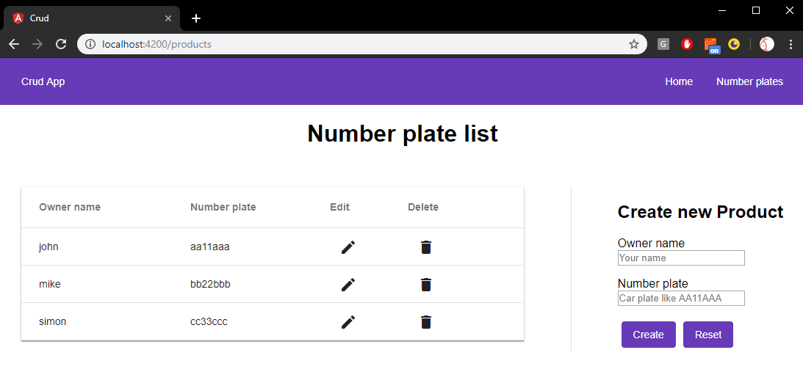

# Crud Front end

This is basic Crud app (front end only). For back end please go to `https://github.com/FilipMachinia/CrudBack`.

The app uses:
* Angular 8 with CLI (Ivy broken due to @angular/flex-layout)
* NodeJS with data saved in .json
* Angular Material
* RxJS
* Responsive design - on mobile table view changes to column
* British car plate validation in format: AA11AAA
* loading spinner for all backend actions

## Set up
To run the app do the following for both front and back end:
* clone the repo
* make sure you have Node >= 10
* run npm i 
* npm start
* go to  http://localhost:4200/ to run the app
